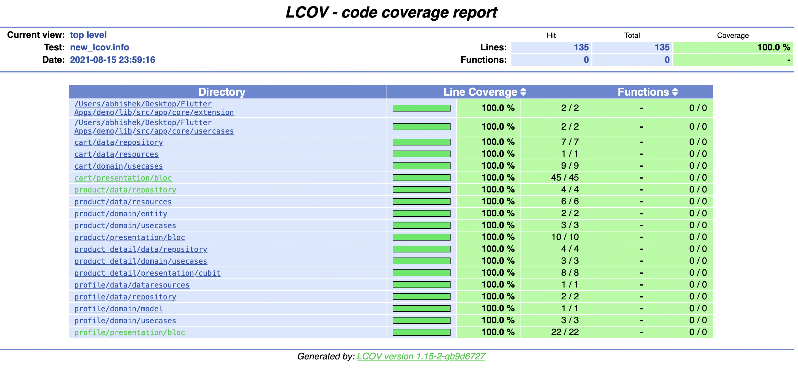

# Flutter demo

Built with clean architecture and domain driven design with clear seperation of `Presentation`, `Domain` and `Data` layers.

✅ Presentation layer: Contains

    🔆 UI components like widgets and screens

    🔆 BLoC: State management layer

    🔆 View model

✅ Domain layer: Contains

    🔆 Data model / Data class to be used for the presentation layer

    🔆 Mapper: Combines data from more than one data classes

    🔆 Usecase: These use cases orchestrate the flow of data to and from the entities, and direct those entities to use their Critical Business Rules to achieve the goals of the use case.

    🔆 Abstract repository

✅ Data layer: Contains the implementation of repository which defines the data source (local or remote)

✅ Data flows: From data layer to presentation layer

✅ Call flows: Presentation layer to data layer

## Technical design

[Architecture technical design](docs/technical_design.md)

**NOTE: Please run the shell script to generate code before `flutter pub get`**

```sh
sh script/code_generator.sh
```

**Generate test report**

```sh
sh test/report/generate_report.sh
```



[Video of demo](video/video.mov)
